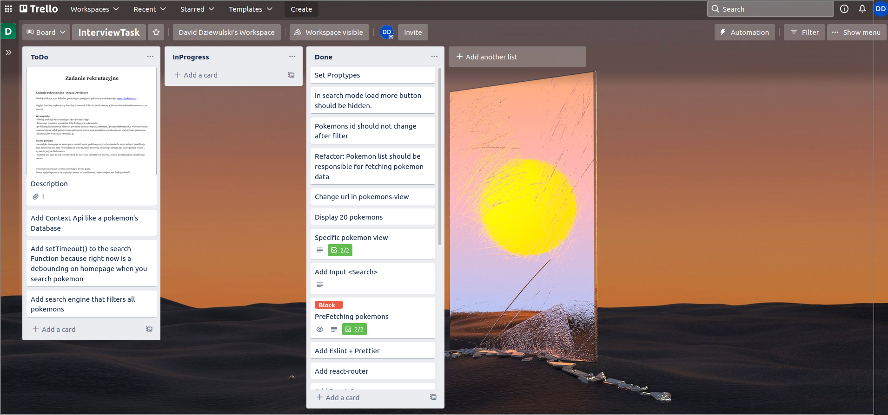

Technologie których użyłem:

  -React
  -Bulma
  -Html
  
  Biblioteki:
    -react-query
    -react-router
    -eslint
    -prettier
    -axios
    

Założenia:  

  - Zbuduj Aplikację wykorzystując create-react-app [V]
  - HomePage powinnien wyświetlać listę dostępnych pokemonów [V]
  - Zmiana Adresu pojedyńczego pokemona [V]
  - Zmiana Widoku pojedyńczego pokemona [V]
  - Input który filtruje aktualne dostępne pokemony po stringu [V]

ToDo:

  - Utworzyć contextApi gdzie mógłbym zapisać globalny stan aplikacji mam na myśli dane, które pobieram z Api[-]
  - Filtrowanie pokemonów po wszystkich pokemonach, które są w Api[-]
  - Owrapować funkcję szukająca po stringu w setTimeout(), który wywołałby dopiero funkcje po jakimś czasie a w międzyczasie wyświetlić spiner, który animuje ładowanie, aby uniknąć "debouncing".[-]

Podsumowanie:
 
  Bardzo dziękuję za przysłane mi zadanie, ze względu na czas, jakim dysponowałem nie byłem w stanie wykonać zadania w 100% ukazujących moje umiejętnośći, jednakże mam nadzieję, że przesłane przeze mnie rozwiązanie, które Państwu dostarczyłem, ukazuje mój potencjał na stawowisko Junior React Developera.

   